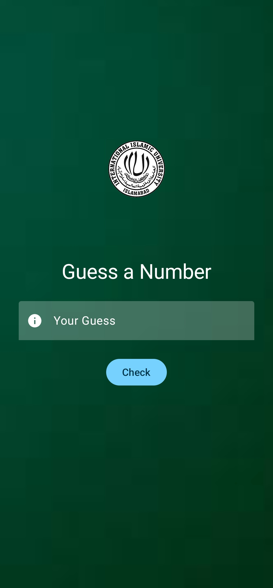
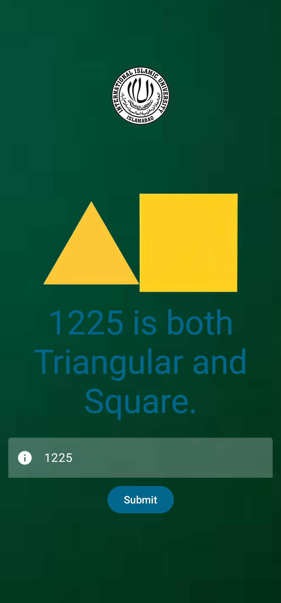
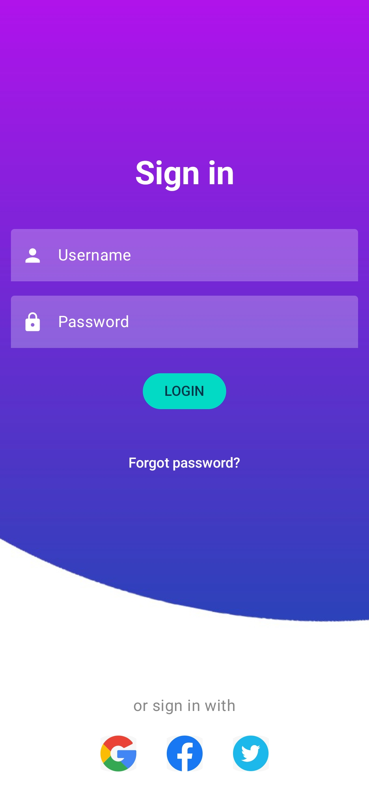
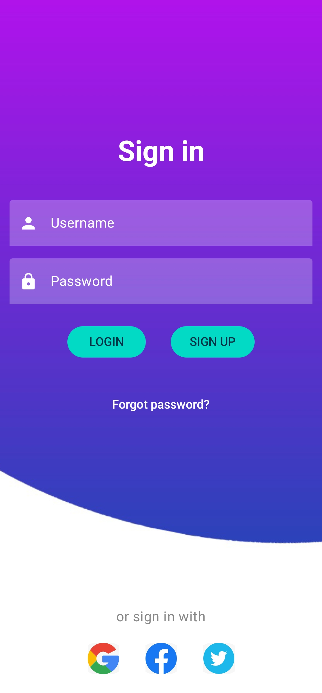
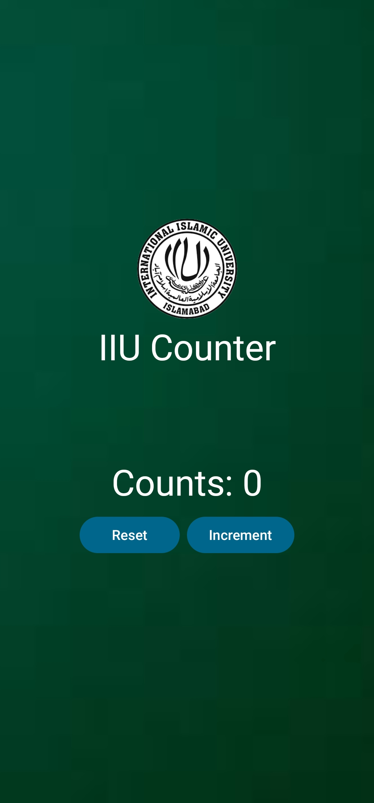

# Android Apps Collection

This repository contains several simple Android apps developed using Jetpack Compose. Each app has a specific functionality, providing hands-on learning in app development. Below are brief descriptions of each app, along with screenshots to showcase their UI.

## 1. Currency Converter App
**Description**:  
The Currency Converter App allows users to convert USD to PKR in real-time. It features a clean and minimalistic interface where users input the amount in USD and get the equivalent amount in PKR instantly. A great tool for anyone dealing with currency exchange.

---

## 2. Guess App
**Description**:  
The Guess App is a fun number-guessing game. The user picks a number, and the app provides feedback on whether the guess is too high or too low until the correct number is found. It’s an engaging way to practice logical guessing.

---

## 3. Shapes App
**Description**:  
The Shapes App determines whether a given number represents a square, a triangular number, both, or none. It also visually displays the corresponding shapes, making it an interactive way to learn about these mathematical figures.

---

## 4. Google Login App
**Description**:  
This app provides a simple Google login functionality using Firebase authentication. Users can sign in with their Google account and get access to the app's content securely. The interface is straightforward, with an intuitive login page.

---

## 5. Email Login App
**Description**:  
The Email Login App uses Firebase for authentication, allowing users to sign in or sign up using their email and password. It ensures a secure login process, with simple options for both existing users and new users to register.

---

## 6. Counter App
**Description**:  
A simple Counter App with a button to increment the counter and a reset button to reset it back to zero. The app offers an easy-to-use interface for demonstrating state management in Jetpack Compose, ideal for beginners.

---

## How to Run the Apps
1. Clone this repository.
2. Open the individual project in Android Studio.
3. Build and run the app on an emulator or a physical device.

---
